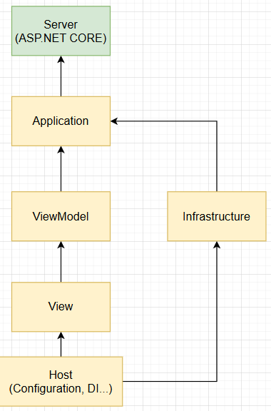

# Application
서버와의 통신 로직(API 호출, DTO 매핑 등)과 외부 종속성에 대한 포트를 포함합니다.  

비즈니스 도메인은 서버에 있으며, 클라이언트에서는 이를 단순히 호출/소비합니다.

# ViewModel
뷰의 상태와 사용자 상호작용(명령)을 추상화한 로직을 포함합니다.  

UI와 Application 계층 사이에서 데이터 바인딩을 담당합니다.

# View
사용자 인터페이스(UI)를 담당합니다.

화면에 데이터를 표시하고, 사용자의 입력을 ViewModel로 전달합니다.

UI 로직만 포함하고 비즈니스 로직은 포함하지 않습니다.

# Host
애플리케이션의 진입점(Entry Point) 입니다.

의존성 주입(Dependency Injection), 설정(Configuration), 로그 설정, 미들웨어 등록 등
런타임 환경 구성을 담당합니다.

## 사진
