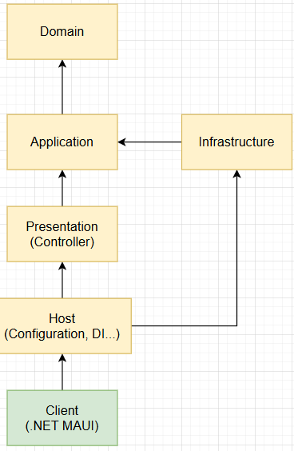

# 실행방법
https://github.com/EricKwon94/TradingKing/releases/tag/1.0.1

# 오늘의 단타 왕
MAUI, ASP.NET Core, SignalR, EFCore, CleanArchitecture, EventSourcing

가상화폐를 모의투자 하여 시즌별 랭킹 1위를 달성해보세요!

모든 유저들의 실시간 자산 랭킹을 확인해보세요.

시즌은 운영자가 원하는 시간에 종료됩니다.

# 인프라

# Client
## Application
서버와의 통신 로직(API 호출, DTO 매핑 등)과 외부 종속성에 대한 포트를 포함합니다.  

비즈니스 도메인은 서버에 있으며, 클라이언트에서는 이를 단순히 호출/소비합니다.

## ViewModel
뷰의 상태와 사용자 상호작용(명령)을 추상화한 로직을 포함합니다.  

UI와 Application 계층 사이에서 데이터 바인딩을 담당합니다.

## View
사용자 인터페이스(UI)를 담당합니다.

화면에 데이터를 표시하고, 사용자의 입력을 ViewModel로 전달합니다.

UI 로직만 포함하고 비즈니스 로직은 포함하지 않습니다.

## Host
애플리케이션의 진입점(Entry Point) 입니다.

의존성 주입(Dependency Injection), 설정(Configuration), 로그 설정, 미들웨어 등록 등
런타임 환경 구성을 담당합니다.

### 사진

# WebServer
## Domain
핵심 비즈니스 규칙과 엔티티, 값 객체(Value Object), 도메인 서비스가 위치합니다.

외부 기술이나 프레임워크에 의존하지 않습니다.

애플리케이션의 순수한 비즈니스 로직을 표현하는 계층입니다.

## Application
도메인 계층과 외부(프레젠테이션, 인프라 등) 사이를 조정하는 역할을 합니다.

트랜잭션, 워크플로, 유스케이스 단위의 비즈니스 프로세스 흐름을 담당합니다.

도메인 객체를 사용하지만, 도메인 규칙 자체를 정의하지는 않습니다.

## Presentation
사용자나 외부 시스템으로부터 들어오는 요청(Request)을 처리하고 응답(Response)을 반환합니다.

컨트롤러나 API 엔드포인트가 위치합니다.

비즈니스 로직은 포함하지 않고, Application 계층에 위임합니다.

## Host
애플리케이션의 진입점(Entry Point) 입니다.

의존성 주입(Dependency Injection), 설정(Configuration), 로그 설정, 미들웨어 등록 등
런타임 환경 구성을 담당합니다.

### 사진
