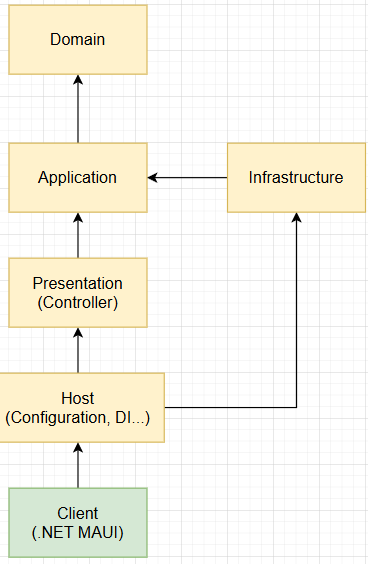

# Domain
핵심 비즈니스 규칙과 엔티티, 값 객체(Value Object), 도메인 서비스가 위치합니다.
외부 기술이나 프레임워크에 의존하지 않습니다.
애플리케이션의 순수한 비즈니스 로직을 표현하는 계층입니다.

# Application
도메인 계층과 외부(프레젠테이션, 인프라 등) 사이를 조정하는 역할을 합니다.
트랜잭션, 워크플로, 유스케이스 단위의 비즈니스 프로세스 흐름을 담당합니다.
도메인 객체를 사용하지만, 도메인 규칙 자체를 정의하지는 않습니다.

# Presentation
사용자나 외부 시스템으로부터 들어오는 요청(Request)을 처리하고 응답(Response)을 반환합니다.
컨트롤러나 API 엔드포인트가 위치합니다.
비즈니스 로직은 포함하지 않고, Application 계층에 위임합니다.

# Host
애플리케이션의 진입점(Entry Point) 입니다.
의존성 주입(Dependency Injection), 설정(Configuration), 로그 설정, 미들웨어 등록 등
런타임 환경 구성을 담당합니다.

## 사진
